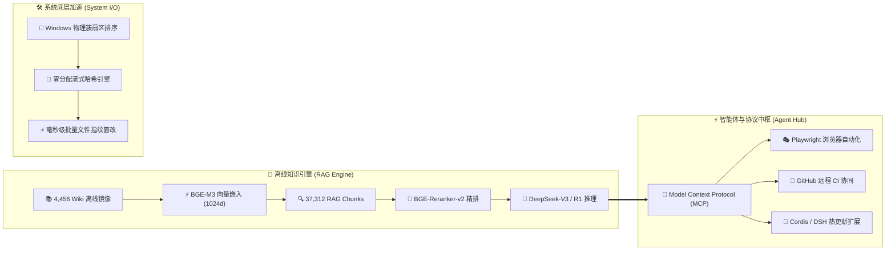

<div align="center">

<!-- 🌊 Cyber Gradient Wave Header -->


<!-- ⚡ Animated Neon Typing Subtitle -->
<a href="https://github.com/a1113622001">
  
</a>

<br/>

<!-- 🛡️ Cyber Status & Metrics HUD -->
<p align="center">
  
  
  
  
</p>

</div>

---

### 🖥️ 赛博控制台 / Quantum Terminal HUD

```yaml
┌───[ operative: 白夜 / Baiye @ quantum-node ]─────────────────────────────────────────┐
│                                                                                      │
│   /\_/\      OPERATIVE     : 白夜 (Baiye / a1113622001)                              │
│  ( o.o )     CORE RUNTIME  : Windows 11 Pro x64 / Linux Hybrid Architecture          │
│   > ^ <      RAG CLUSTER   : 4,456 Wiki Pages (Offline) · 37,312 Dense Chunks        │
│              MCP DAEMON    : [Playwright, GitHub, Sequential-Thinking, Memory]       │
│              I/O ENGINE    : Zero-Allocation Stream · Physical HDD Cluster Sorter    │
│              DELIVERY SLI  : 99.999% Assurance · Autonomous Self-Healing Active      │
│                                                                                      │
└───────────────────────────────────────────────────────────────────[ STATUS: READY ]──┘
```

---

### 🌌 全景系统架构拓扑 / Systems Architecture Topology



---

### 🚀 核心矩阵 / Featured Project Artifacts

#### 🔮 [Noita 中文知识库 · 离线 RAG 问答系统](https://github.com/a1113622001/noita-wiki-zh)
> **4,456 页 Wiki 离线镜像 · BGE-M3 向量 RAG · DeepSeek 生成 · MCP / Skill 协议生态**
- 🎯 **痛点攻克**：彻底击穿 Wiki 官方限流壁垒，构建 100% 离线高可用检索。
- 🧠 **检索增强**：37,312 RAG Chunks + BGE-M3 (1024d) + BGE-Reranker-v2-M3 二次精排。
- 🔌 **协议互联**：原生适配 Model Context Protocol (MCP) 与 Agent Skills 生态。
- 🏷️ `Python 3.10+` `BGE-M3` `DeepSeek V3 / R1` `MCP Protocol` `Vector RAG`

---

#### ⚡ [dsh-auto-update](https://github.com/a1113622001/dsh-auto-update) & [dsh-session-stats-panel](https://github.com/a1113622001/dsh-session-stats-panel)
> **DeepSeek Harness (Cordis) 自动化热更新引擎 & 实时会话成本看板**
- 🔄 **无感热更**：npm 差量版本轮询 + 后台 Staging 预热，支持应用退出或 Web UI 即时热重载。
- 💰 **成本透视**：实时统计会话 Token 吞吐率、Cache-Hit 命中率与 DeepSeek API 实时账单。
- 🛡️ **规范工程**：基于原生 Web Components 抽屉面板与 `@deepseek-ai/schemastery` 全链路强类型约束。
- 🏷️ `Node.js (ESM)` `Cordis Framework` `Web Components` `Analytics & Cost` `Schemastery`

---

#### 🛠️ [Batch-Hash-Changer](https://github.com/a1113622001/Batch-Hash-Changer)
> **Windows 批量哈希修改工具（物理簇 I/O 深度调优）**
- 💽 **磁盘优化**：底层物理簇顺序寻道排序，大幅降低机械硬盘寻道延迟。
- ⚡ **零内存分配**：采用流式指针追加，毫秒级快速修改文件哈希指纹，杜绝内存溢出。
- 🏷️ `PowerShell 7+` `Windows Internals` `Zero-Alloc Stream` `High Performance`

---

#### 🎵 [Ease Music Player](https://github.com/a1113622001/ease-music-player)
> **嵌入式歌词解析与跨平台高性能原生音频引擎**
- ⚡ **混合架构**：Android 客户端 + 底层 Rust 高性能原生动态音频库联动。
- 🏷️ `Android` `Rust Core` `TypeScript` `Audio Pipeline`

---

### ⚡ 技能武器库 / Tech Stack Armory

<div align="center">
  <a href="https://skillicons.dev">
    
  </a>
</div>

<br/>

---

<!-- 🎮 Cyber Snake Eating Contributions Animation -->
### 🐍 活跃轨迹 / Contribution Matrix

<div align="center">
  <picture>
    <source media="(prefers-color-scheme: dark)" srcset="https://raw.githubusercontent.com/a1113622001/a1113622001/output/github-contribution-grid-snake-dark.svg">
    <source media="(prefers-color-scheme: light)" srcset="https://raw.githubusercontent.com/a1113622001/a1113622001/output/github-contribution-grid-snake.svg">
    
  </picture>
</div>

---

<details>
<summary><b>⚡ 点击展开 [NEURAL TERMINAL DEEP DIVE & DEV LOGS]</b></summary>

```json
{
  "operative": "白夜 (Baiye)",
  "specializations": [
    "Autonomous Agentic Delivery",
    "Offline Vector Knowledge Graph Construction",
    "Model Context Protocol (MCP) Toolchains",
    "Low-Level Windows Stream Optimization"
  ],
  "current_focus": "Building high-assurance multi-agent execution engines on Antigravity",
  "motto": "Code with precision, deliver with certainty."
}
```
</details>

---

<!-- 🌊 Footer Wave -->
<div align="center">
  
  <p align="center">
    <sub>✦ Designed & Crafted with Cyberpunk Aesthetics by 白夜 · Powered by Antigravity ✦</sub>
  </p>
</div>